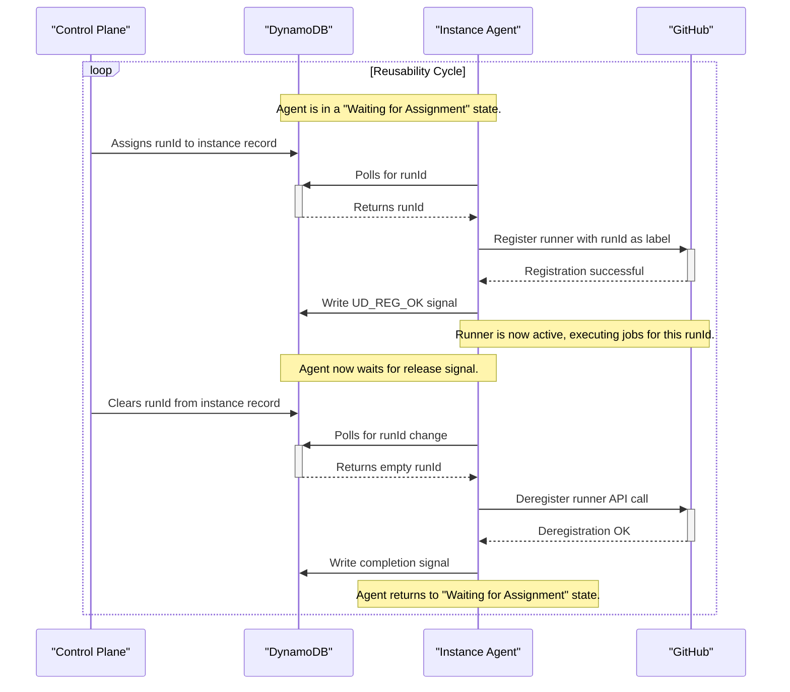

# Instance Agent Lifecycle

Every EC2 runner instance runs a **persistent, state-driven agent** responsible for its entire lifecycle. This agent allows an instance to be safely reused across multiple, distinct CI workflows by observing state changes in DynamoDB. It transitions between states like "Waiting for Assignment" and "Executing Job" based on commands from the control plane, making each runner a reusable, warm asset.

## One-Time Initialization

Upon first boot, the agent performs a brief, one-time setup sequence:

* It configures logging and fetches necessary metadata from the EC2 environment.
* It executes an operator-provided **pre-run script**. This allows for custom setup like installing dependencies or warming caches before the runner is used. The success or failure of this script is signaled back to the control plane.
* It downloads the GitHub Actions runner software.
* Finally, it launches its background agents and enters the main reusability lifecycle.

## Parallel Support Agents

Two independent agents run in parallel to the main lifecycle, providing continuous health monitoring and a safety net:

* **Heartbeat Agent**: This agent periodically writes a "PING" record to DynamoDB. This allows the control plane to continuously monitor the instance's health and liveness.
* **Self-Termination Agent**: This agent periodically checks the instance's `threshold` timestamp in its DynamoDB record. If the current time exceeds this deadline, the agent will command the EC2 instance to terminate itself. This acts as a crucial fail-safe against orphaned or runaway instances, helping to control costs.

## The Reusability Lifecycle: A Coordinated Sequence

After initialization, the agent enters its main reusability loop. This lifecycle is a coordinated sequence of interactions between the instance, the control plane (acting via DynamoDB), and GitHub, allowing the instance to handle multiple jobs securely.

The lifecycle shown in the diagram consists of three main phases:

1. **Wait for Assignment & Register**: The agent polls DynamoDB until the control plane assigns it a `runId`. It then uses this ID to register with GitHub.
2. **Execute & Wait for Release**: The runner is active and executing jobs. The agent concurrently polls DynamoDB, waiting for the control plane to signal completion by clearing the `runId`.
3. **Deregister & Cleanup**: Once the `runId` is cleared, the agent deregisters from GitHub, signals its completion, and returns to the beginning of the loop, ready for a new assignment.

## Architectural Cornerstones

* **Communication via DynamoDB Signals**: The agent communicates its status (e.g., `UD_REG_OK`) back to the control plane by writing signals to its DynamoDB record. This decoupled, asynchronous communication is fundamental to the system's design.
* **Job Isolation with `runId` Labeling**: Using the unique `runId` as the runner's sole label is a critical security and correctness feature. It guarantees that jobs from one workflow can only land on a runner that has been specifically provisioned or claimed for it.

:leafy_green:
