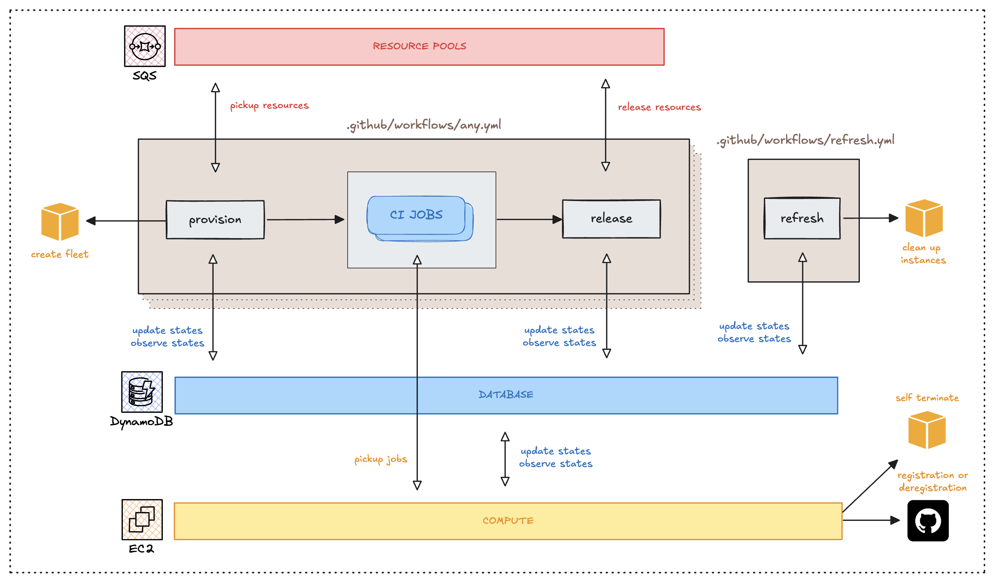
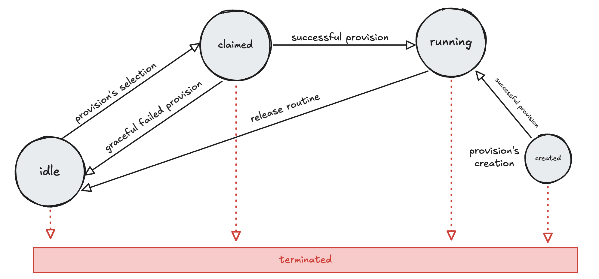

# Detailed Design

## Detailed Architecture Overview

Below is the detailed architecture diagram showcasing all components:



The core components in more detail:

- **Controlplane**: Orchestrates instance management via distinct operational modes.
- **Resource Pool (SQS Queue)**: Manages idle instances ready for reuse.
- **Central State Store (DynamoDB)**: Maintains current instance state, signaling indirectly between controlplane and instances.
- **Instances/Runners**: EC2 machines executing the actual CI jobs.

## Core Concepts Expanded

Let's clearly expand the foundational concepts briefly introduced in [index.md](../index.md):

### Controlplane Operational Modes

The controlplane operates in three distinct modes:

- **Provision**: Acquires EC2 resources either by claiming from the resource pool or provisioning new instances.
- **Release**: Returns instances to the resource pool after workflows complete, resetting instance state.
- **Refresh**: Periodically validates instance health and lifecycle thresholds, initiating termination of unhealthy or expired instances.

!!! note "Controlplane modes visualized"
    ```mermaid
    graph TD
        A[Workflow Starts ⚡️] --> B(Provision Mode);
        B --> C[Instance Ready for CI];

        D[Workflow Completes ⚡️] --> E(Release Mode);
        E --> F[Instance Returned to Pool];

        G[Manual 👈/Cron ⏱️] --> H(Refresh Mode);
        H --> I[Initialization/Maintenance];
    ```

These modes interact through a shared state mechanism stored in DynamoDB, enabling indirect signaling between runners and the controlplane.

### **Instances and Runners**

EC2 Instances—also called runners—are dynamically managed resources executing CI workflows. They maintain minimal agents installed at instance startup for:

- Initializing runner environments via custom scripts (`pre-runner-script`).
- Registering and deregistering with GitHub Actions runner APIs.
- Sending periodic health signals (heartbeats) to the shared state store.
- Observing state changes (e.g., claim attempts, runId assignments) for timely registration.

### **Instance States and Transition Mechanisms**

Each instance has a clearly defined lifecycle managed through distinct states stored in DynamoDB:

| State | Technical Definition        |
|--------------|----------------------|
| **created**  | Instance created; initialization pending (waiting on runner registration & scripts). |
| **running**  | Runner initialized and actively accepting CI jobs.|
| **idle**     | Instance healthy and available in the resource pool for reuse.  |
| **claimed**  | Instance reserved by a workflow, undergoing final validation checks.   |
| **terminated**| Instance terminated following expiration, unhealthy status, or explicit shutdown.|

These states allow the controlplane to track and manage instances seamlessly.

**Detailed State Transition Diagram**



- created->running: Initialization completes successfully.
- running->idle: CI job completes, instance returns to the pool.
- idle->claimed: Instance is selected by a new workflow.
- claimed->idle: Placed back to pool if handled failures encountered.
- all->terminated: Triggered by due to expiration or health failures.

This state management underpins the controlplane’s ability to reuse runners effectively and terminate them automatically when no longer viable.

## Lifecycle of an Instance

To gain a better understanding with how the controlplane manages runner, we’ll walk step-by-step through the journey of a single instance. From creation, initialization, running jobs, reuse, and termination. Goal here is to introduce the critical mechanism bit by bit (ie. indirect signaling, workflow identifiers (runId), and thresholds)

### Creation of an Instance

Imagine a workflow kicks off, requiring compute resources to execute CI jobs. Via `provision`, the controlplane first looks to reuse resources and checks the [resource pool](./resource-pool.md) (implemented as an SQS queue) for idle instances.

- If a suitable instance is found, it gets immediately claimed.
- If not, the controlplane creates a new EC2 instance.

As soon as an instance is created, it enters the created state in our central database (e.g., DynamoDB):

```json
// new record in DB
{
  "instanceId": "i-123456",
  "state": "created",
  "runId": "run-7890",
  "threshold": "2025-05-31T12:00:00Z" // timeout for 'created' state (details below)
}
```

!!! note "What is `runId` and what is it for?"
    `runId` is the [id that Github uniquely assigns to the workflow](https://github.com/orgs/community/discussions/26965) and is part of the Github Context. We use this to uniquely associate this instance with the workflow's CI jobs, ensuring it only runs the intended jobs.

!!! note "What is `threshold` for?"
    `threshold` here defines a timeout for how long this instance can remain in a specific state; we’ll explain this fully in the Expiration section below.

### Initialization and Indirect Signaling

After creation, the instance begins initializing itself. Since the controlplane and the instances cannot communicate directly, they use indirect signaling through a shared database.

The instance performs two [essential initialization steps](./instance-bootstrap.md):

- Pre-runner Script: Runs the user-defined script on the instance.
- Runner Registration: The instance registers itself as a GitHub Actions runner using the `runId`.

Once both steps complete successfully, the instance signals readiness, and the controlplane updates the state to running in the database:

```json
// state created->running, new threshold assigned
{
  "instanceId": "i-123456",
  "state": "running", 
  "runId": "run-7890",
  "threshold": "2025-05-31T12:10:00Z"
}
```

??? note "~A Closer Look :mag:~ Indirectly Signaling that the Instance is Ready :zap:"
    Due to network and security constraints - the controlplane can’t communicate directly with the instances. They rely instead on regularly reading and writing their state in a shared central database (DynamoDB). Below is a lower level view of a successful registration.
    ```mermaid
    sequenceDiagram
        participant Controlplane as "Provision (Controlplane)"
        participant DynamoDB as "State Store"
        participant Instance
        participant Github

        Note over Controlplane, Instance: Controlplane creates instance with AWS
        Controlplane->>DynamoDB: Immediately register (state: created, runId)
        Instance->>Instance: Initialize (pre-runners-script)
        Instance->>Github: Register with runId
        Instance-->Github: Ready to pickup CI jobs with runId
        
        Controlplane->>+DynamoDB: Periodically Read/Monitor State
        Instance->>DynamoDB: Signal Readiness ✅
        DynamoDB->>-Controlplane: Found Readiness Signal ✅ 

        Controlplane->>DynamoDB: Transition (created->running)
        Note over Controlplane: Finish provision
    ```

### Running CI Jobs

With initialization complete, the instance is now ready to execute CI jobs. Your GitHub Actions workflow specifically targets this instance by referencing the workflow’s unique ID (runId) in its job definition:

```yaml
runs-on: ${{ github.run_id }}
```

Since the instance registered itself with exactly this `runId`, it guarantees that these jobs run only on the correct, assigned instance. Jobs run smoothly without interference from other workflows.

<!-- ☀️ -->

### Releasing an Instance Back to the Resource Pool

When all CI jobs finish, the workflow executes `release`. This is tasked with safely placing the runner to the resource pool - enabling reuse.

The release component ensures the instance is safely reset and ready for future workflows. Behind the scenes, the controlplane and the runner instance coordinate via the shared state store to facilitate a clean transition. This coordination includes clearing the `runId`, safely deregistering from GitHub Actions, and confirming readiness for reuse.

At a lower level, the responsibilities of the controlplane and instance are as follows:

- **Controlplane**: Updates instance state, monitors signaling, places instance back into pool.
- **Instance**: Detects state change, deregisters from GitHub Actions, signals completion.

Here’s how this transition appears in the database:

```json
// state running->idle, runId: "run-7890"->"", new threshold assigned
{
  "instanceId": "i-123456",
  "state": "idle",
  "runId": "", 
  "threshold": "2025-05-31T12:20:00Z"
}
```

The instance is now in the resource pool and ready for another workflow.

??? note "What is placed in the resource pool? :mag:"
    ```json
    // Distilled version
    {
      "instanceId": "i-123456",
      "usageClass": "on-demand",
      "instanceType": "c6i.large",
    }
    ```
    Remember, the [resource pool](./resource-pool.md) is simply a collection of SQS queues. To see how this is used, see the next section.

??? note "~A Closer Look :mag:~ How is the Instance Deregistered and placed in the Resource Pool? :zap:"
    ```mermaid
    sequenceDiagram
        participant Controlplane as "Release (Controlplane)"
        participant DynamoDB as "State Store"
        participant Instance
        participant GitHub

        Note over Controlplane: Release triggered after CI jobs
        Controlplane->>DynamoDB: Scan instances with the workflows run_id
        Note over Controlplane: Found instance id/s under run_id 

        Controlplane->>DynamoDB: release instance (state: running->idle, runId: '')
        Note over Controlplane, Instance: Instances sees emptied runId, initiates deregistration

        Controlplane->>+DynamoDB: Look for deregistration signal

        Instance->>GitHub: Deregister runner from Github
        GitHub-->Instance: No more active session with Github ✅
        Instance->>DynamoDB: Signal successful deregistration ✅
        DynamoDB->>-Controlplane: Successful Deregistration signal found ✅
        Note over Controlplane: Add instance to resource pool
        Note over Controlplane: Release concludes 
        Instance-->DynamoDB: Looking for new assigned runId ♻️
    ```

### Reusing Instances (Selection & Claiming)

With the released instance now available in the resource pool, let’s imagine another workflow triggers requesting compute resources. The controlplane first consults the resource pool to check if existing idle resources match the workflow’s requirements.

The controlplane evaluates key attributes from resource pool messages, some of these include:

- usageClass (spot or on-demand) to align with cost or availability needs.
- instanceType to satisfy performance constraints.

For example, a workflow request might look like:

```yaml
# provision inputs
with:
  usage-class: on-demand
  allowed-instance-types: "c*" # Matches any instance type starting with 'c'
```

Matching against our resource pool entry:

```json
{
  "instanceId": "i-123456",
  "usageClass": "on-demand",
  "instanceType": "c6i.large"
}
```

Since our previously released instance `i-123456` matches these requirements exactly, the controlplane attempts to claim `i-12346`.

If the claim is successful (no other workflow has claimed it first):

```json
// state idle->claimed, runId: ""->"run-9999", new threshold assigned
{
  "instanceId": "i-123456",
  "state": "claimed",
  "runId": "run-9999",
  "threshold": "2025-05-31T12:30:00Z"
}
```

!!! note "Racing against other Workflows :zap:"
    Claims might fail if a race condition occurs (another workflow claiming simultaneously). In such cases, the controlplane either selects another idle instance or provisions a new one.

After successful claiming, the instance detects the new `runId` (ie. `run-9999`) and registers itself with GitHub with this label. Shortly thereafter, the controlplane transitions the instance from `claimed` to `running`, indicating it is now ready to execute CI jobs.

??? note "~A Closer Look :mag:~ How is an instance claimed and how do we know it's ready? :zap:"
    ```mermaid
    sequenceDiagram
        participant Controlplane as "Provision (Controlplane)"
        participant DynamoDB as "State Store"
        participant Instance
        participant Github

        Note over Controlplane: Fetch instance from pool
        Controlplane->>Controlplane: Instance deemed valid
        
        Controlplane->>DynamoDB: claim instance (state: idle->claimed, runId: new_run_id)
        Note over Controlplane, Instance: If claim suceeds then new run_id is given ⚡️ instance detects new_run_id via db
        Controlplane->>+DynamoDB: Monitor for registration signal
        
        Instance->>Github: register with new_run_id
        Instance->>DynamoDB: send registration signal ✅
        Instance-->Github: pickup any ci jobs ♻️
        DynamoDB-->>-Controlplane: registration signal found ✅
        
        Controlplane->>DynamoDB: State Transition (state: claimed->running)
        Note over Controlplane: Completes if compute is fulfilled
    ```

This reuse cycle repeats smoothly as long as instances remain healthy, continue matching workflow requirements, and remain within configured operational lifetimes.

??? note "Requiring more instances than the pool?"
    Say that the workflow request requires more resources than what the pool can provide? See request:
    ```yaml
    # provision inputs
    with:
      instance-count: 10 # <---
      usage-class: on-demand
      allowed-instance-types: "c*"
    ```
    This is expected, the controlplane simply creates new resources to satisfy the requirements. After successful creation, selected and created instances are transtitioned to `running`.

### Expiration, Thresholds, and Termination

If, for some reason, instances from getting stuck or running longer than intended, each state (created, running, idle) carries a `threshold` - this is a timestamp indicating how long an instance may safely remain in its current state. If the instance surpasses this timestamp, it’s considered expired:

```json
{
  "instanceId": "i-123456",
  "state": "running",
  "runId": "run-7890",
  "threshold": "2025-05-31T12:10:00Z" // timestamp expired
}
```

When the refresh worker which executes via cron sees an expired instance, it issues a termination command directly to AWS (TerminateInstances API call) and transitions it to terminated.

```json
{
  "instanceId": "i-123456",
  "state": "terminated",
  "runId": "",
  "threshold": ""
}
```

For redundancy, the instance itself observes its own lifetime. If it sees that it has expired, it and issues a termination command directly to AWS to terminate itself.

??? note "~A Closer Look :mag:~ When does the Refresh Worker terminate expired instance/s :zap:"
    ```mermaid
    sequenceDiagram
        participant Refresh_Worker as "Refresh (Controlplane)"
        participant DynamoDB as "State Store"
        participant AWS

        Note over Refresh_Worker: Triggered by CRON ⏱️
        Refresh_Worker->>+DynamoDB: Scan for instances (check expired threshold)
        DynamoDB-->>-Refresh_Worker: Returns expired instance ids
        Refresh_Worker->>AWS: TerminateInstances(instance_ids)
        Note over AWS: Instance/s is terminated 🪦
        Refresh_Worker->>+DynamoDB: Update instances to terminated (state: 'terminated', runId: '', threshold: '')
    ```

??? note "~A Closer Look :mag:~ How does the Instance carry out self-termination? :zap:"
    ```mermaid
    sequenceDiagram
        participant Instance
        participant DynamoDB as "State Store"
        participant AWS

        Note over Instance: Background Process in Instance 
        Instance-->DynamoDB: periodically fetch own threshold ♻️
        Note over Instance: Compares threshold against local time
        Instance->>Instance: determine self as expired
        Instance->>AWS: TerminateInstances(instance_id)
        AWS->>Instance: AWS terminates instance
        Note over Instance: shutdown
    ```

These mechanisms cleans up expired resources. They ensure the infrastructure remains healthy and efficient by automatically cleaning up unused/problematic instances.

<!-- ☀️ -->

## Technical Deep Dives

For a detailed exploration of individual components, their challenges, and solutions, see:

- [Provision](./provision/provision.md): Instance reuse/creation, selection logic, resource matching, and AWS API interactions.
- [Release](./release.md): Safe instance deregistration and resource pool placement.
- [Refresh](./refresh.md): Controlplane initialization, maintenance, and periodic checks for safe termination of long-running instances.
- [Resource Pool](./resource-pool.md): SQS-backed resource pool, message structure, and producer/consumer roles.
- [Instance Initialization](./instance-initialization.md): Instance startup, GitHub registration/deregistration loop, heartbeats, and safe self-termination.

<!-- ☀️ -->
