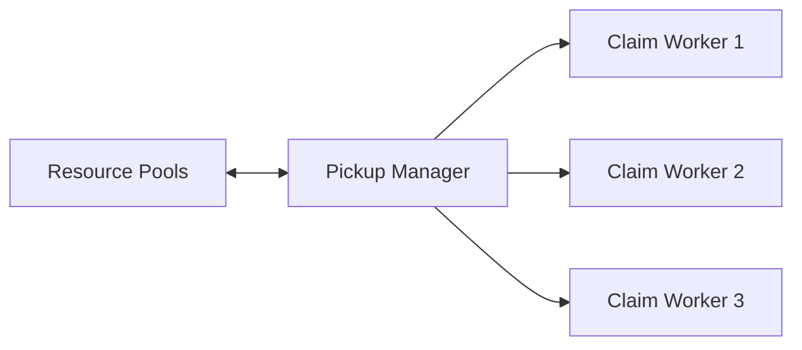

# Provision

When running a github actions workflow, `provision` is the controlplane component that is responsible for ensuring that the required resources for a workflow is available prior to running ci jobs. This page covers the major sub-components of provision which makes this possible.

## Selection

Selection is a sub-component of `provision` that is designed to pickup and reuse any idle instances from the resource pool. This section covers what makes up selection in order to ensure that the instances are picked up, claimed and validated in a timely manner.

### Resource Pool <---> Pickup Manager <---> Claim Workers

Within selection, the bit that interfaces with the resource pool is the Pickup Manager(PM). A bunch of claim workers receives instances to inspect from this PM which then are used to facilitate the actual claiming and checking of health and registration. The claim workers work in parallel to ensure that selection is done in a timely manner (we want to know as soon as possible if the resourcepool can or cannot fulfill the workflow's requirements). The amount of claim workers defined to be equal to the amount of resources `provision` requires (ie. `instance-count` parameter).

To better see this interation, see below:



### Resource Pool <---> Pickup Manager

Lets look at the resource pool to Pickup manager interface. When a claim worker requests a resource, the pickup manager interfaces directly with SQS. It gets the message from SQS which generally looks something like this (note that the message is immediately deleted from SQS to reduce resource contention):

```json
{
  "instanceId": "i-123456",
  "usageClass": "on-demand",
  "instanceType": "c6i.large",
  "cpu": 2,
  "mmem": 4096
}
```

There are two actions that the pickup manager can do once a message has been picked up from the pools - Requeue the message or Pass on to Claim Workers. Lets look at each in detail:

- Requeue to Pool: Given the message above. Imagine that your provision configuration is something like this:

    ```yaml
    with:
      mode: provision
      allowed-instance-types: "m* r*" # <--- not c*
    ```

    What we can see is that the instance is not valid for the workflow due to the mismatch in instance types. As such, the message is simply requeued or put back to the resource pool for others to inspect. Keep in mind that this is the same for when we define other attributes like the usage-class and the resource-class.

- Passed to Claim Worker: Say that the message fits the constraints of the provision, then the pickup manager simply passes the message to the requesting claim worker!

### Claim Worker

As before, we internally create as many claim workers as the amount of resources that the workflow needs. These claim workers interact with the PM to get a valid instance. Theres a few things that the claim worker does to further evaluate the validity of the instance for the workflow:

**Claiming**

The first thing that the worker does is to claim the instance. At a lower level, this is a state transition backed by DDB's conditional update. The condition being, at the time of update, the record has to be of:

- The following state `idle`
- The following runId `""` (empty runId)

This conditional update functions to solve the problem where multiple workflows are trying to claim the same resource, only one instance can succeed. If a claim is successful, this internal record guarantees isolation. This is claiming looks like:

```json
// state idle->claimed, runId: ""->"run-9999", new threshold assigned
{
  "instanceId": "i-123456",
  "state": "claimed",
  "runId": "run-9999", 
  "threshold": "2025-05-31T12:30:00Z"
}
```

Again, the new runId is the workflow runId that provision is running in.

**Post Claim Checks**

After being claimed, our instance undergoes final checks before the worker considers it valid. Finally we do some checks on the instance itself. First of all, we check if the instance is still healthy. The way that we do this is via checking time in which the heartbeat record was updated (see the [instance page](../todo.md) to see what exactly this looks like). The evaluation of whether an instance is healthy is defined by the heartbeat period multiplied by 3.

So for example, if the heartbeat period is 5s, an instance is only healthy if the heartbeat came in to the database within the last 15s.

Finally, if healthy, we then look for the registration signal.

See, then we transition changes the `runId`, an internal system within instance detects this change `runId` and starts a registration routine (see the [instance page](../todo.md) to see how this works exactly). Anyway, this registers the instance against the `runId` allowing it to pickup jobs for the workflow.

Once this registration is successful, it sends a registration signal to the database which our controlplane detects. (see the [instance page](../todo.md) to see what this looks like exactly). After seeing this registration signal, the claim worker deems the instance fit for running and effectively hands it off to the `post-provision` routine for the final state transition (see this below).

### Problem: How can the Pickup Manager know the Resource Pool is "Exhausted"

**Single Invalid Message**

Now theres a problem here. Imagine this scenario - you have one workflow that needs a very specific instance type. Say `r6*`. But the resource in the pool has a type `c6i.large`. As before, the PM picks this up, inspects it, and requeues it - then the PM re-inspects the queue again and gets the same instance! We're stuck in a loop!

So to solve this problem, the PM singleton has an internal criteria of evaluating if a queue is exhausted. What it does it that it keeps tabs of how many times it has encountered a specific id. If it has encountered it a handle of times (about 5 times), then it consideres the queue as "exhausted" - and returns a `null` to any requesting claim worker - indicating pool exhaustion.

!!! note "Relative exhaustion"
    As such, we can see that a RP can still have messages in it while being classified as exhausted. This brings us to another nice side effect. RP exhaustion is not a global thing, its relative to the workflow level. IE one can see a workflow and see it as exhausted whereas another can view is as not exhausted.

**Many Invalid Messages**

BUT ... we still have a problem here. Imagine again that we have MANY `"c*"` instances in the pool BUT the workflow is picky (still needs a specific `r6*` instance)! As per our overview of [resource pool](../todo.md), the designed partitioning does not help here, so what will happen?

Well, the PM will have to cycle through the resource pool a few times to recognize that it has been exhausted. In this worst case scenario, the time for selection grows in proportion to the amount of invalid messages in the queue.

Thankfully, from my testing, the PM is able to go through ~50 SQS messages per second, so I dont think this could be too much of an issue until you're running 100s of machines with really diverse and specific needs for CI.

!!! bug "Need to Add Thresholds to Messages"
    For the PM to safely disregard messages, there needs to be a threshold attribute in the messages. Likely the same as the state threshold at the time that it is enqueued in the pool. This also means that we dont need to put the heartbeat check in the PM but can remain in the worker

## Creation

Creation is a sub-component of `provision` that is designed to work with AWS to create any instances if the RP cannot fulfill the workflow's compute requirements. This section should be vastly simpler then selection.

### Fleet Creation

When creating the instance, we use the EC2 CreateFleet API. This API is pretty great because we simply have to express what our computing needs are and AWS provisions them for us (and rejects if there our computing needs cannot be met. Ill link the API docs [here](../todo.md).

But, in terms of how we work with this internally, consider the following provision inputs:

```yaml
with:
  mode: provision
  usage-class: on-demand
  allowed-instance-types: "r6* m6* c6*"
  resource-class: xlarge
  instance-count: 10
```

### Fleet Validation & Interactions

## Post-Provision

The **Post-Provision** component is responsible for gracefully handling successful/unsuccessful provisioning in addition to a routine which dumps any provisioned resources when if something unexpected happens.

### Successful Provisioning

### Unsuccessful Provisioning

### Something went wrong: Dumping Resources
