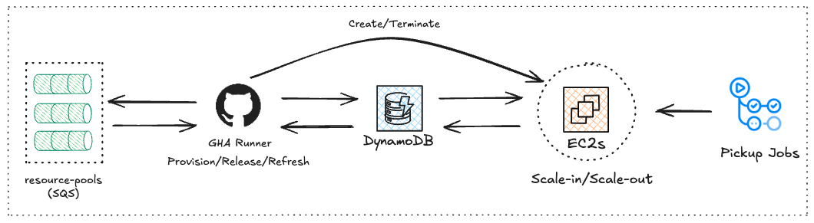
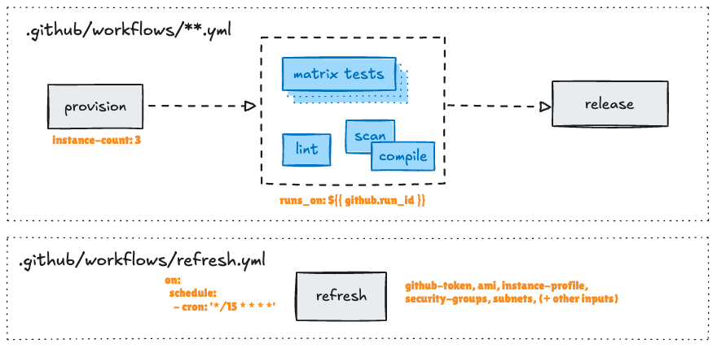

# Scale & Reuse Self-Hosted EC2 Runners inside GitHub Actions :recycle: :rocket:

This Action enables you to run a pool of self-hosted EC2 runners within the
Github Actions runtime. No separate controlplane with Kubernettes/Terraform/CDK.
Resource pooling, scale-in/scale-out, termination of the runners are all handled
by the action. Free cake!!

## :zap: Motivation

This action was explicitly designed to **embed** the controlplane within Github Actions, avoiding the complexity of separate infrastructure or specialized expertise in Kubernetes/Terraform. While existing solutions either require external control planes or sacrifice performance for simplicity, this project aims to combine the best of both approaches.

With this embedded approach, we get the following benefits:

- **Embedded Controlplane** - No deploying and managing separate control planes. No webhook configuration.
- **Runner Logs** - Logs are readily accessible within the [workflow run logs](https://docs.github.com/en/actions/monitoring-and-troubleshooting-workflows/monitoring-workflows/using-workflow-run-logs).
- **Resource Pooling** - When provisioning for a workflow, this action first interrogates the shared pool of resources for reuse, minimizing cold-starts and optimizing costs.
- **Simplified Operations** - Manage multiple instances per job without complex wrapper patterns.

Inspired by tools like [Actions Runner Controller](https://github.com/actions/actions-runner-controller), [terraform-aws-github-runner](https://github.com/github-aws-runners/terraform-aws-github-runner), and [machulav/ec2-github-runner](https://github.com/machulav/ec2-github-runner), this action takes a streamlined, YAML-centric approach to runner pooling and lifecycle management.

## :star: Getting Started

To see how this fits in your Github Actions code - see: [Prerequisites](getting-started/prerequisites.md) :arrow_right: [Quickstart](getting-started/quickstart.md) :arrow_right: [Advanced Configuration](getting-started/advanced-configuration.md).

## :mag: Overview

This action operates using three distinct modes (`provision`, `release`, `refresh`) to control, share, and scale self-hosted EC2 runners directly within GitHub Actions. The diagram below illustrates how these modes fit into your GitHub Actions workflow files:

Here’s an *simplified* overview of each operational mode:

- `provision`: Allocates existing EC2 instances from the shared pool or creates new ones if needed for your active workflow jobs.
- `release`: Returns the EC2 instances used by a workflow back to the shared pool, making them available for reuse by other jobs.
- `refresh`: Manages the overall configuration and health of the EC2 runner pool. This mode is designed to be run on a schedule (e.g., via a cron job) to perform ongoing maintenance tasks

### :carrot: Detailed Design

To see how this works internally - see [how-it-works](architecture/overview.md)
